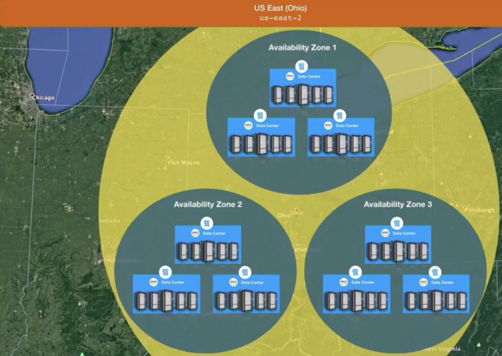
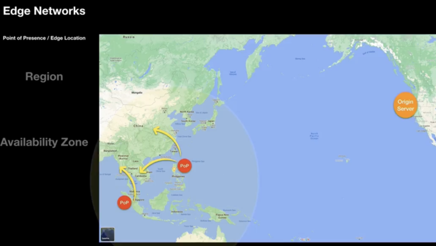
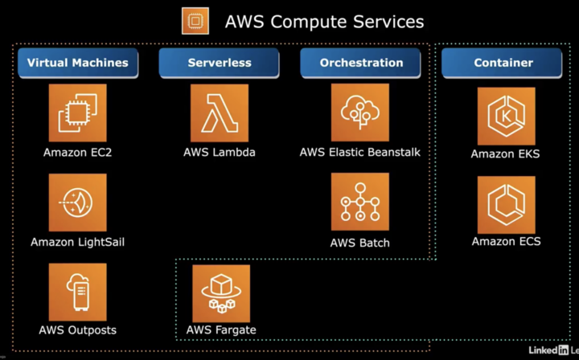
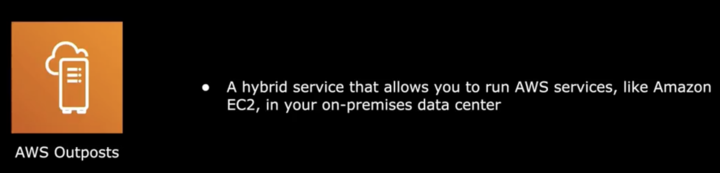
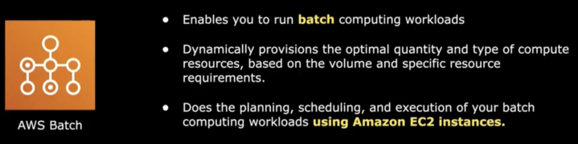
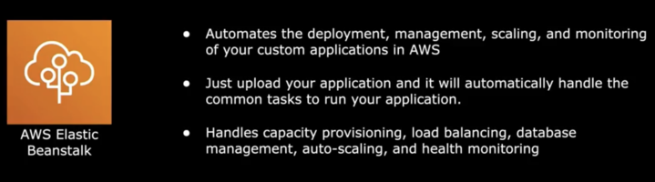

# Week 1 notes

## Overview

- AWS started in 2004 inside Amazon, used by internal customers only
- IaaS: Infrastructure as a Service
- AWS became a public cloud service provider in 2006

## Global infrastructure    

- Serves 1+ million active customers in over 190 locations (219+ points of presence)
- To achieve high availability you can chose to use two or more availability zones
- AWS infrastructure design for high availability and fault tolerance:

### Availability Zone
- Made up of multiple data centres
- One or more data centres and are typically within 100km/60miles from each other
- Enables better fault tolerance in the case of a data centre failure

### Region

- Includes multiple availability zones
- Replicate data across multiple AZs
- Regions always located in the same country as AZs for data privacy compliance

### Edge networks

- Caches content to reduce latency to allow customers globally to fetch from local servers rather than origin servers which may be the other side of the globe
- Points of presence (PoP) are where data is cached to and sourced from the origin server
- Also known as as a content delivery network (CDN)

## AWS compute services

### Virtual machines

#### EC2 (Elastic Compute Cloud)

- Computing service that runs virtual servers
- IaaS (Infrastructure as a service)
- Shared responsibility for managing
    - AWS manages the physical server requirements, e.g. data centre, network, etc.
    - You are required to manage the server, e.g. OS updates

#### AWS Lightsail

#### AWS Outposts

- AWS rack that is delivered to your site

### Serverless

Services managed entirely managed by AWS, i.e. you do not have to do anything other than deploy code

#### Lambda

- Compute service
- Only pay for the compute time that was consumed
- AWS manages all aspects
- Lambda function is what you control and programme
- Can special thousands of requests in seconds
- Supports:
    - Java, Go, Ruby, Python, NodeJS, and others
    - Runtimes are managed by AWS

#### Fargate
- This is also a container service.

### Orchestration

These services do not perform compute, they orchestrate compute.

#### AWS Batch

- For batch workloads
- Dynamically provisions optimal compute resources based on workload
- Uses EC2 instances to perform your batch workload

    
#### Elastic Beanstalk

- Automates deployment, management, scaling and manage of your applications in AWS
- Developers retain full control of EC2 instances

## AWS container services

## AWS database services